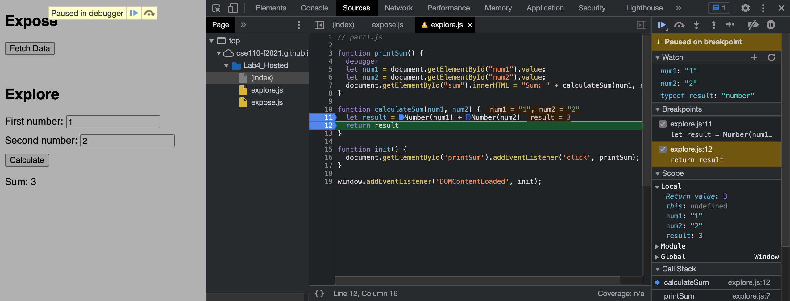

# Part 3 Answers:
1. We can see that the bug lies with the type of the variables *num1* and *num2*. Because they are both strings, the typof(result) is a string. This is precisely why when we do the sum of 1 and 2 for example, the webpage returns the string '12' because it simply combines the two input strings '1' and '2' together.
2. One fix that I thought of was that since *num1* and *num2* are both strings, we can type cast them as the Number type first and then add them together. After making this change, the program worked and was returning correct sums.
   
   